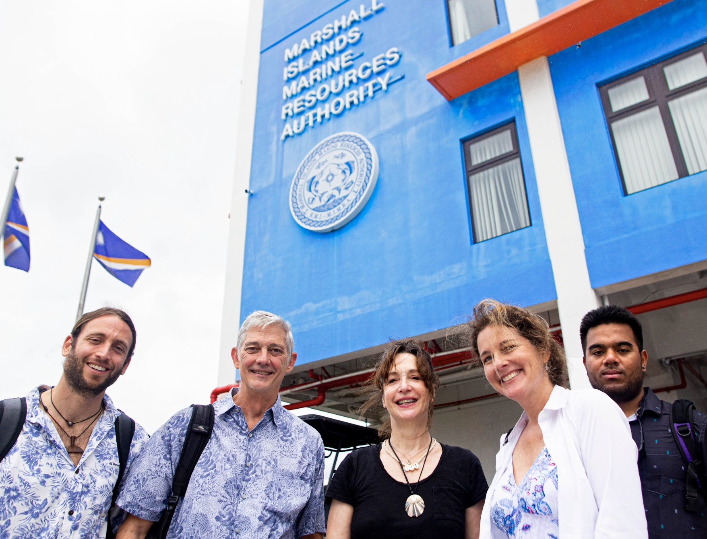
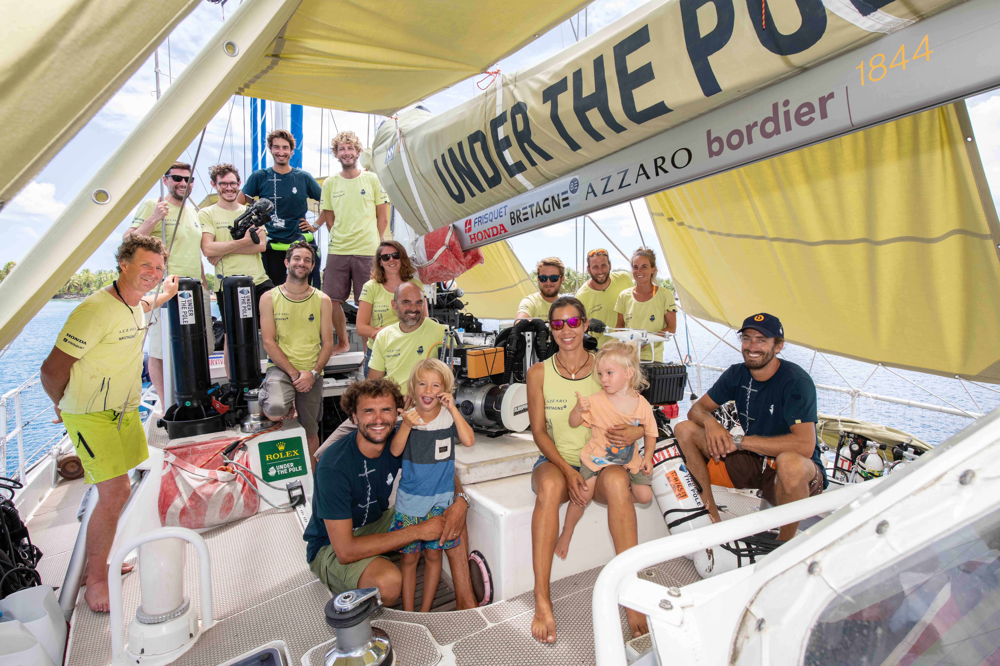
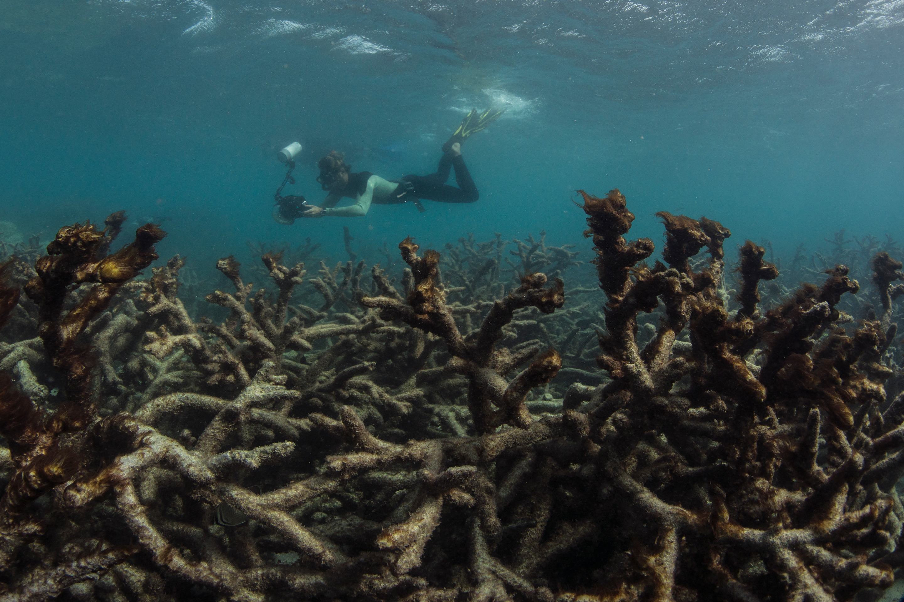
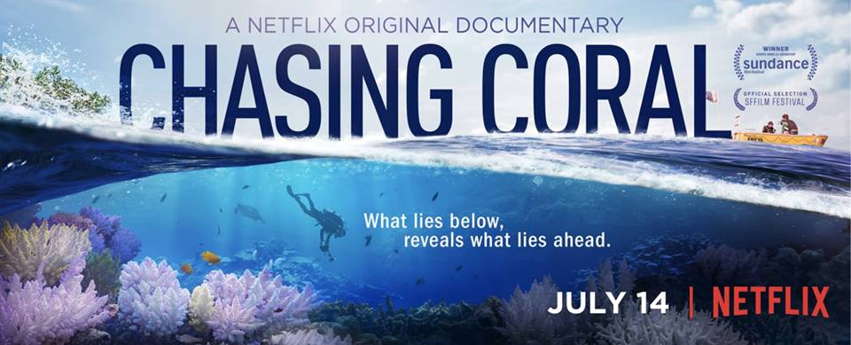

## Postdoctoral Investigator at WHOI

I completed a one-year Postdoc at Woods Hole Oceangraphic Institution [WHOI](https://www.whoi.edu/) at [Cohen Lab](https://www2.whoi.edu/site/cohenlab/super-reefs/), working on the [Super Reefs Project](https://superreefs.whoi.edu/). A joint project from WHOI, Stanford and The Nature Conservancy to identify the reefs most likely to withstand future heatwaves and conserve them to ensure the future of coral reefs with climate change. 

During this Postdoc, I learned a lot about ocean modelling and realised (even more) how little we know about coral ecology and how important it is to collect in situ and long-term data. Super Reefs uses high-resolution hydrodynamic models (developed by WHOI scientists) based on Regional Ocean Modeling System (ROMS) to quantify fine-scale spatial variability in thermal history and heat stress exposure of coral communities. Then, overlap these micro-thermal environments with ecological data (previous bleaching responses) and physiological heat resistance (hotbox experiments) to understand the bleaching patchiness and predict the coral communities more likely to survive future heatwaves. The goal is to apply microtarget conservation of heat-resistant coral communities to ensure sources of heat-tolerant larvae to seed future reefs while we call for the needed energetic transition that will shift climate change. 

Working with such an amazing team was an absolute pleasure. 

```{r layout = "l-page", echo=FALSE}

```


```{r layout = "l-page", echo=FALSE}
knitr::include_graphics("Hawaii_photo.jpg")
```

Yet I was ready to move on and go back to live in the tropics, closer to my beloved coral reefs and with more diving. 


## Deephope expedition with Under The Pole. A dream come true

When I discovered the Why (name of the sailing boat) and met the Under The Pole (UTP) team in Mo’orea (French Polynesia), I realised that it would be very cool. After doing sporadic fieldwork in Moorea, I jumped on board in Tikehau (Tuamotu Archipelago), and I stayed there during the whole expedition, only jumping out at the end. We sailed to Tikehau, Rangiroa and Raroia from the Tuamotu Archipelago; Hiva Oa, Tahuata and Fatu Iva from the Marquesas Islands; Mangareva from the Gambier Archipelago and Raivavae from the Austral Archipelago. Then, we sampled Moorea again, Tahiti and Makatea. An unforgettable journey! 

While there, I shared my time with Heloise Rouzé (Postdoc of the Project) and Michel Pichon (Professor, honorary researcher and guru of coral taxonomy). We spent endless hours on the deck processing samples, but our conversations were priceless in scientific learning. 

I am not going to lie; I did not do much deep diving during this expedition because I still needed to gain the TEK diving skills. And I am still in the process of acquiring them! Divers from the UTP team were diving down to at least 100 m regularly, requiring a lot of experience. Anyway, I was happy with my freediving, snorkelling and diving until more or less 40 m depth. 

In terms of science, we collected coral samples for taxonomy, genetics (connectivity and microbiome) and physiology. Some of the coral samples could easily represent the deepest records. We also collected environmental/oceanographical variables for the modelling, acoustic landscapes and eDNA. In a few words, our most important discoveries were a huge field of corals at 60-100 m in Makatea and the deepest light-dependent scleractinian coral at 172 m in the Gambier Islands. 

Aside from scientific fieldwork skills and knowledge, I gained sailing and TEK diving experience. The atmosphere on board was lovely. Our daily life was: working a lot (diving almost every day – if not snorkelling), relaxing on the “appero », working again, partying at night and repeat. I miss this lifestyle. 

After the end of the expedition, I completed my JJCCR diving course. I need to gain TEK diving experience, and I hope to have the opportunity to return to all these expedition sites somehow.

If you want to know more about this expedition, I recommend the film : "[La quete des Profondeurs](https://www.facebook.com/watch/?v=580468036050005), available in Arte. 


```{r layout = "l-page", echo=FALSE}

```

## My PhD - what a journey!

If I look back, my PhD has been an amazing experience. I grew up as a scientist and also as a human. Yet, there have also been tough moments. Luckily my passion and perseverance made me go through these ups and downs, and now, I am proud of what I achieved. 

I can separate my PhD into three sections and two working places. First, the fieldwork with UTP all around French Polynesia (over a year of my PhD). Being on a mission requires a lot of work, responsibilities and energy. You must know how to work in a team, and I promise you that – literally – I never stop. This section was also the most adventurous and exciting. Every day was different, snorkelling, diving and sailing to discover new places. Second, the processing of the samples and data acquisition (~a year and a half). During this period, my life became a pure routine. I spent endless hours in the lab and/or analysing photos. My days were super busy, and I did not have time for anything else outside my PhD. Anyway, I needed robust data with enough replicates to run my analysis, so it was justified by the fact that I wanted to have the data for analysis. I complained a lot, but it was always better to work because I wanted to finish as soon as possible. Third (about two years), the analysis time and writing manuscripts. At this stage, I had to fly back to Europe to live in Perpignan, regardless of my desire. I was leaving paradise on Earth (French Polynesia). Here, the ups and downs reached their maximum levels. Sometimes I felt my data was useless, and sometimes I had the best data. I had to synthesise all my ideas and data visualisations into paper storylines. Then, apply fancier tests to have more robust results. Writing and publishing a paper takes a lot of time. First, you need to convince yourself, then your supervisors, then your co-authors and then the editors and reviewers of the journal. Thanks, hard work pays off, and all time invested in the preparation of the manuscript turned out to be an easier and faster publishing process. I was luckier with my PhD manuscript submissions than with my internship paper. The fantastic fact was that all the time focused on my manuscripts, co-author feedback, and reviewers also translated into an easier way of wrapping up my PhD. For me, all sections have been necessary so far, yet I missed fieldwork and Polynesia so much during the last years of my PhD.

To finish, I want to thank everyone who contributed to my success. Of course, these include my supervisors, but also many colleagues and friends who have been a real support in an altruistic way. These people are now co-authors of my publications and are mentioned in the acknowledgements of my thesis. Please do not hesitate to request the PDF of my thesis [here](gonzalo.prb@gmail.com).


## Two internships at the CRIOBE

### Fieldwork: Living and participating everywhere in a research station.

Having the opportunity of doing my internship in Mo’orea, the heart of French Polynesia, was a dream coming true.

I worked under the supervision of Laetitia Hedouin. Initially, to work on a temporary database (Polynesia Mana) and to review available information about Mesophotic Coral Ecosystems in French Polynesia, it quickly became a multidisciplinary period. 
I helped in the Coral nurseries, preparing and running experiments in mesocosms and the Coral spawning marathon. That was a lot of diving and time on the field. 

My analysis of the database turned into a paper (my first one as a first author and accepted after three rounds of review). 
Some of the algorithms I coded to measure the bleaching were necessary for other papers. The internship went so well that with Laetitia and Valeriano, we applied to the Ecole Doctorale EPHE to get a grant for a PhD. 

### Coding, coding and coding. Falling in love with Rstudio

The time you find out marine biology is more data analysis than diving. Supervised by Valeriano Parravicini, I spent a lot of time in R studio, and thanks to try-error-try, tutorials, StackOverflow, and Valeriano's advice, I started enjoying the algorithms. Well, and also thanks to a lot of frustration, thinking and "eureka" moments. 

I worked on a functional bio-geographical approach to coral reef fish worldwide. When we were about to submit our manuscript, a new paper came out, making the traits I used not valid anymore for future studies. I would have loved to finish it, but I had to move on with my master, so someone else took the responsibility. Science is a challenging path. 

To finish, I must say that replacing being underwater with coding gives me another way of satisfaction. 


## Making it to the cover of newspapers around the world 

Richard Vevers [The ocean Agency](https://www.theoceanagency.org/) took this picture of me while filming bleaching on Lizard Island during the production of [Chasing Coral](https://www.chasingcoral.com/). Since then, this picture has been featured in many international journals, including the New York Times, BBC, The Guardian, etc. The experience with Chasing Coral convinced me how important communication is for scientists. I firmly believe the general public should know what we are doing as scientists. People have the right to be aware, and we must pass the message, so please reach out if you work in science communication. 

```{r layout = "l-page", echo=FALSE}

```


## 2015-2016 Chasing Coral. From volunteering to an Emmy Award 

```{r layout = "l-page", echo=FALSE}
knitr::include_graphics("Chasing_Coral_Team.jpg")
```

Without any doubt, the best experience of my life so far. I join the team in the Keppel Islands (Inner GBR) to help install some underwater cameras. Soon, I got along very well with Zack Rago (the coral nerd and main character of the film) and Jeff Orlowski (the film director).

We were living in the inner Great Barrier Reef, diving every day to record coral bleaching and give corals a voice to the world to show that Climate Change is a serious issue. After nearly two months, severe bleaching started in the Mid-Northern Great Barrier Reef but not in the Keppels. Solution? Let’s pack and go where bleaching is happening.

Like this, I arrived at Lizard Island. Probably the most spectacular and selective island I have ever been to. There I had the most beautiful but also depressing dives of my life. From the plane, you could already see all tones of blues, from the lagoon, to the coral reefs to the open ocean. But wait, something was wrong. Corals were surprisingly fluorescing, showing bright colours. Later I will understand this beauty was not good. Our first divings to chose filming frames were mixing feelings difficult. It was brightly beautiful, but the corals were dying. We call it the beauty of death. Only animals like corals can show their maximum beauty before dying.


```{r layout = "l-page", echo=FALSE}
knitr::include_graphics("Fluorescing_Corals.jpg")
```


Corals were at the peak of heat stress and about to bleach, completely turning white, showing their skeleton. It was not only a couple of colonies. All the reefs turned white. There were still sharks and fishes, but these slowly disappeared, turning into a silent graveyard. (Except for herbivorous fish like Dori). But that was just the beginning; day after day, diving in the same sites and manually framing time-lapse images of corals dying. Corals started to be colonised by algae showing they were dead. Soft corals were melting. Reefs turned quiet. I am not exaggerating if I say I was seeing the entire ecosystem collapse.

Once we had all the necessary content of the corals bleaching and dying, we returned to the Keppel Islands to retrieve the underwater cameras. Luckily, corals were doing better there. 

(Image here)

I thought my experience with Chasing Coral was over, but no, Jeff kept a surprise for me when he told me I could join the team again to go diving on the outer Great Barrier Reef. The idea was to dive and film some of the remaining healthy sites. That was on the Etheral sailboat and was, by far, the fanciest experience of my life. Diving close by eminent scientists (Charlie Veron and Ove Hoegh-Guldberg), I did the best divings of my life while learning from the best coral experts. There was still hope.

The expedition ended up in Lizard to have a final view of the filming frames. I think we all cried underwater.

During this experience, I met and learnt a lot from coral-leading scientists: Charlie Veron, Ove Hoegh-Guldberg, Andrew Baird, Justin Marshall and Terry Hughes. We became friends with the Chasing Coral Team. And most importantly, I fell in love with corals because of their beauty, fragility and importance. I realised we could not lose them, so I committed myself to continuing my academic journey into coral reef research. 

```{r layout = "l-page", echo=FALSE}

```


This is an experience I will never forget. You can watch the film now on [Netflix](https://www.netflix.com/title/80168188) 


## Volunteering at University of Queensland. 

This is one of the best coral reef labs worldwide. I did two experiences.

### Mesophotic.org

This project came as a volunteering experience at Coral Reef Ecosystems Lab (University of Queensland-Australia). Under the direction of Pim Bongaerts, we started developing the website [mesophotic](mesophotic.org). It is an online meta-database where all publications and contents related to mesophotic (from 30 to 150 m depth) are offered.

The website displays content by platforms, categories, focus groups, locations and researchers. It has a behind-the-science section and early-career-scientists for communication. We display all tweets using the #mesophotic hashtag.

As a database curator and content editor, I encourage you to contact us to contribute to the richness of our website. From this experience, I started working on databases and coding.
The paper is available [here](https://academic.oup.com/database/article/doi/10.1093/database/baz140/5677403).

### Heron Island fieldwork

Additionally, a fieldwork opportunity arose, and I went to Heron Island Research Station. There, I  helped set up the Mesocosms project of Sophie Dove and Ove Hoegh-Guldberg. During my experience there, I learnt a lot about corals and how to conduct experimental studies.


## Undergraduate student in the Canary Islands

Moving to the Canary Islands for my studies was simply the best choice. Even if I must accept, I first moved there mainly because of surfing and diving; I quickly became even more in love with the ocean while learning about it. My studies and my leisure time were all in or about the ocean. Well, during my first two years, I probably preferred surfing more than studying, but good for me, I passed my exams without much struggle. Studying only when necessary, just before the exams. From my third year, I realised how important my grades would be for the future, so my desire to learn and be competitive made me focus on my studies as my priority and keep surfing and diving as the perfect breaks and free-time activities. 
During my undergrad, my subject interests went from pure marine biology to physical oceanography to marine conservation and communication. To be honest, I knew I wanted to have an ocean-related professional career, but I needed to find the path. Most importantly, I had to look for opportunities abroad. 


## .....................................................


Go back to [main page](https://gonzaloperezrosales.netlify.app/)


